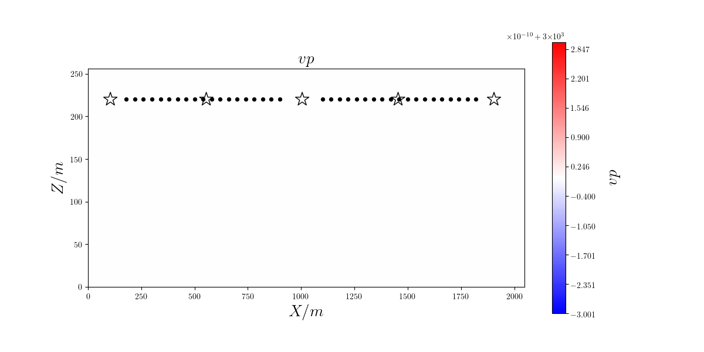

Examples: Available For Download
================================

We have prepared a 2D waveform inversion example that is inexpensive enough to run on almost any laptop, desktop, or cluster.

Some additional examples are available for download.  Please review the instructions for the 2D checkerboard test case to get a sense for how to run these other inversions.

Some 2D examples based on the Marmousi model are available `here <http://tigress-web.princeton.edu/~rmodrak/2dElastic>`_.

A 3D Cartesian checkerboard example is available `here <http://tigress-web.princeton.edu/~rmodrak/3dElastic>`_.

A 3D global 1-chunk example is available `here <http://tigress-web.princeton.edu/~rmodrak/ExamplesGlobal>`_. Please note, the compressed archive for this example is very large (> 0.5 GB). *[No longer available because of file size.]*

At a minimimum, one processer is required for the 2D Marmousi examples, 16 processors are required for the 3D Cartesian example, and 64 processors are required for the global 1-chunk example.  See `here <http://seisflows.readthedocs.org/en/latest/usage/usage.html#system-configuration>`_ for more information about running inversions in parallel.

*Note: File hosting services are provided by my alma mater.  The download server may become temporarily unavailable due to system maintenance or permanently unavailable due to expiration of my account.*

Examples: Available Locally
===========================

Users with accounts on "tiger.princeton.edu" can run the following inversions without having to download files or recompile executables.

*2D Regional and Global*

- North America

- Southern California

- Global

- Deep Earth

*2D Near Surface*

- Marmousi offshore

- Marmousi onshore

- overthrust offshore

- overthrust onshore

- BP anticline

- BP salt diapir

*3D Cartesian*

- checkerboard

*3D Global*

- mideast

本地测试：Checkerboard测试
==========================

SeisFlows目录 ``/path/to/seisflows/example`` 下包含一个本地可运行的SPECFEM2D棋盘测试项目（**NPROC=2**）。
程序在命令行下进入目录，完成参数检查后输入::

    sfrun

即开始运行seisflows反演。

震源台站配置
----------
所有震源与台站文件保存于 ``./specfem2d/DATA`` 中，其中震源文件格式为 **SOURCE_xxxxxx** ，多个震源单独保存；台站文件为 **STATIONS** ，包含所有台站信息。

初始模型
-------

反演初始模型保存于目录 ``model_init`` 中，为 :math:`\rho=2000kg/m^3,v_p=3000 m/s` 的均匀Acoustic模型。
模型长2048m米，高256米，震源台站设置和P波结构如下图所示：

棋盘模型
-------

当 ``paths.py`` 文件中未给定 **DATA** 目录时，Seisflows会利用 ``model_true`` 目录下给定的模型计算合成数据并从初始模型开始进行反演。
棋盘模型长2048m米，高256米，震源台站设置和P波结构如下图所示：

.. image:: fig/vp99.png
    :width: 600
    :height: 300
    :align: center

反演结果
-------
反演参数定义于 ``parameters.py`` 内，采用最速下降法进行11次迭代后模型如下图所示：

.. image:: fig/vp11.png
    :width: 600
    :height: 300
    :align: center

归一化目标函数下降曲线如下图所示：

.. image:: fig/misfit.jpg
    :width: 600
    :height: 240
    :align: center