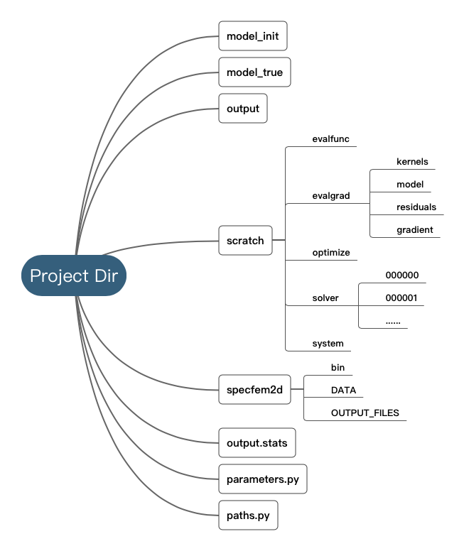
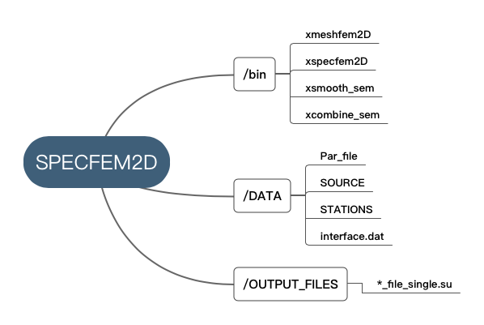
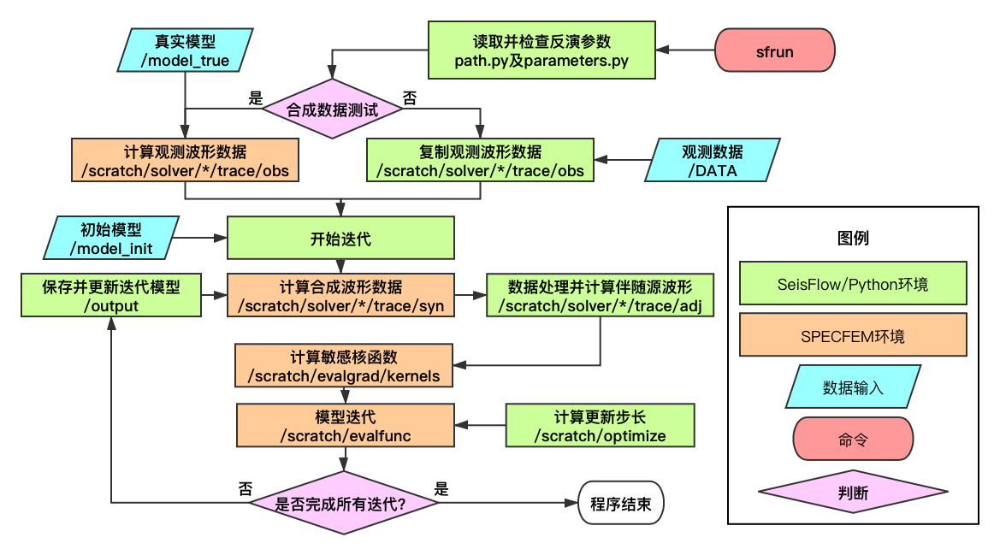

项目目录架构
------------------------

SeisFlows工作目录包含正演程序、模型和参数文件。下图展示了一个典型的SeisFlows项目目录架构：

- model_init: 初始模型目录；
- model_true: 真实模型目录；
- output: 输出文件（如迭代模型与梯度）；
- output.stats: 统计参数输出文件；
- scratch: 进行正演、数据处理、敏感核处理的工作目录；
- specfem2d: 正演程序初始目录，参考 :ref:`specfem2d`
- parameters.py: 反演参数文件，参考 :ref:`parameters`
- paths.py: 路径参数文件，参考 :ref:`path`

``parameters.py`` 和 ``path.py`` 中定义了所有SeisFlows的反演参数。在命令行中运行 ``sfrun`` 或 ``sfsubmit`` 时，程序会首先从这两个文件中读取参数，所以在提交任务给服务器前，这两个参数需要被仔细地检查以减少不必要的计算资源浪费。

.. _specfem2d:

正演程序目录: ``specfem2d``
---------------------------------

下图展示了SPECFEM2D正演程序目录架构：

- /bin:
- /bin/xmeshfem2d: 模型网格剖分程序
- /bin/xspecfem2d: 正演计算程序
- /bin/xsmooth_sem: 敏感核平滑程序
- /bin/xcombine_sem: 敏感核求和叠加程序

- /DATA: 正演参数目录
- /DATA/Par_file: 正演参数
- /DATA/SOURCE: 震源参数
- /DATA/STATIONS: 台站参数
- /DATA/interface.dat 正演介质层面参数

- /OUTPUT_FILES: 输出文件目录

工作流程
--------

SeisFlows的工作流程图如下所示：

.. _parameters:

参数文件: ``parameters.py``
----------------------------------

``parameters.py`` contains a list of parameter names and values. Prior to a job being submitted, parameters are checked so that errors can be detected without loss of queue time or wall time. Parameters are stored in a dictionary that is accessible from anywhere in the Python code. By convention, all parameter names must be upper case. Parameter values can be floats, integers, strings or any other Python data type. Parameters can be listed in any order.

``General``

:``TITLE``:

    Project title.

:``WORKFLOW``:

    Workflow specified for seisflows. 'inversion' and 'migration' are currently supported.

:``SOLVER``:

    Time domain solver specified for seisflows. 参考 :ref:`solver` and :ref:`sfsolver`

:``SYSTEM``:

    System type supported for seisflows. 参考 :ref:`system` and :ref:`sfsystem`
    
:``OPTIMIZE``:

    Optimization method used for inversion. 参考 :ref:`sfoptimize`

:``PREPROCESS``:
    
    Preprocessing workflow specified. 参考 :ref:`sfpreprocess`
    
:``POSTPROCESS``:

    Postprocessing workflow specified. 'base' needs to be specified.

:``MISFIT``:

    Type of misfit for evaluation. 参考 :ref:`sfmisfit`

:``MATERIALS``:

    Materials of simulation domain. 'Elastic' and 'Acoustic' are currently supported. 参考 seisflows.solver.base

``Workflow``

:``BEGIN``:

    First iteration index.

:``END``:

    Last iteration index.

:``NREC``:

    Number of receivers.

:``NSRC``:

    Number of sources. SEM source file needs to be stored with a six-digit index suffix.

:``SAVEMODEL``:

    Frequency of saving model. ``1`` by default.

:``SAVEGRADIENT``:

    Frequency of saving gradient. ``1`` by default.

:``SAVEKERNELS``:

    Frequency of saving kernels. ``0`` by default.

:``SAVETRACES``:

    Frequency of saving traces. ``0`` by default.

:``SAVERESIDUALS``:

    Frequency of saving residuals. ``0`` by default.

``Preprocessing``

:``FORMAT``:

    Data file format.

:``CHANNELS``:

    Data channels. Currenly, 'su', or 'SU' need to be specified.

:``NORMALIZE``:

    Apply normalization for traces. 'NormalizeEventsL1', 'NormalizeEventsL2', 'NormalizeTracesL1', 'NormalizeTracesL2' are currently supported. 参考 seisflows.preprocess

``Filter``

:``BANDPASS``:

    Boolean type bandpass switch for traces.

:``FILTER``:

    Type of filter used. 参考 :ref:`sfpreprocess`

:``FREQMIN``:

    Low frequency corner.

:``FREQMAX``:

    High frequency corner.

``Mute``

:``MUTE``:

    List type switch for trace mute. :ref:`sfpreprocess` for supported options.

``Postprocessing``

:``SMOOTH``:

    Smoothing radius. 参考 ``xsmooth_sem``

``Optimization``

:``PRECOND``:

    Preconditioner type. 参考 :ref:`path` 和 :ref:`sfprecond`

:``STEPMAX``:

    Maximum trial steps

``Solver``

:``NT``:

    Number of time steps defined in Par_file.

:``DT``:

    Time step defined in Par_file.

:``F0``:

    Dominant frequency defined in SOURCE.

``System``

:``NTASK``:

    Number of tasks submitted. Currently, **NTASK** must satisfy 1 <= NTASK <= NSRC.

:``NPROC``:

    Number of processors.

:``MPIEXEC``: 

    MPI executable prefix, e.g., ``mpirun -np 13``. Note for a space at the end of the string, as seisflows concatenates the prefix with SPECFEM executable command.

.. _path:

路径文件: ``paths.py``
------------------------

``paths.py`` contains a list of path names and values. Prior to a job being submitted, paths are checked so that errors can be detected without loss of queue time or wall time. Paths are stored in a dictionary that is accessible from anywhere in the Python code. By convention, all names must be upper case, and all values must be absolute paths. Paths can be listed in any order.

:``DATA``:

    PATH contains seismic data if field data is used for inversion. Data of difference sources should be stored in separate folder. If ``DATA`` directory does not exist, seisflows would automatically generate synthetic data using model from ``MODEL_TRUE``.

:``MODEL_INIT``:
    
    PATH contains model file for initial iteraion.

:``MODEL_TRUE``:

    PATH contains true model for generating synthetic data.
     
:``PRECOND``:

    PATH to user supplied diagonal preconditioner. Seisflows will rescale model parameters based on user supplied weights. 参考 :ref:`sfprecond`

:``MASK``:

    PATH to mask file for gradient scaling. Mask needs to be stored mimicking the file format in which models are stored.    

:``SPECFEM_DATA``:

    PATH to SPECFEM ``DATA`` directory which contians Par_file, SOURCE, and other necessary inputs.

:``SPECFEM_BIN``:

     PATH to SPECFEM ``bin`` directory which contains binary executable command of SPECFEM solver.
