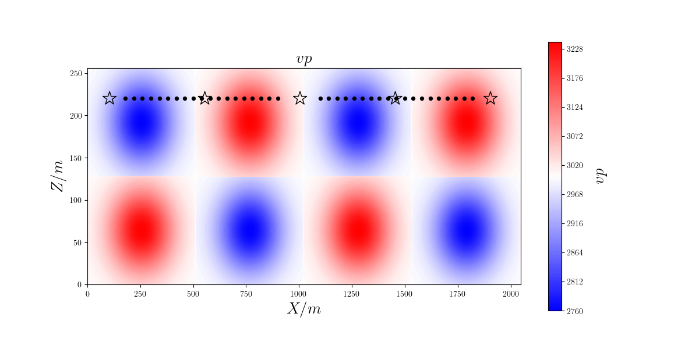
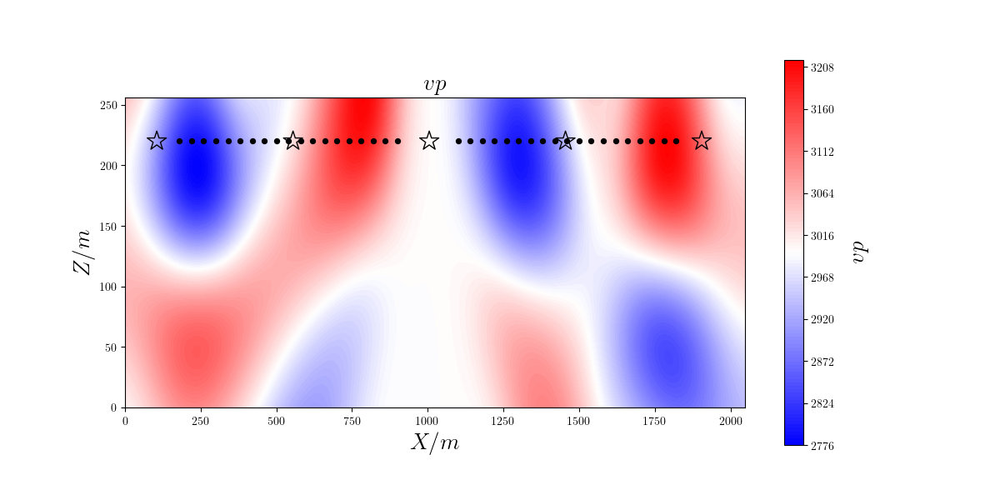
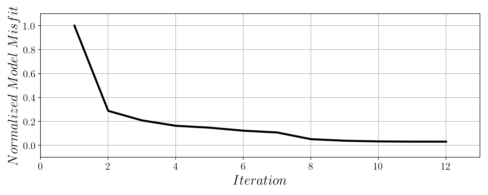

本地测试：Checkerboard测试
==========================

SeisFlows目录 ``/path/to/seisflows/example`` 下包含一个本地可运行的SPECFEM2D棋盘测试项目（**NGPU=1**）。
程序在命令行下进入目录，完成参数检查后输入::

    sfrun

即开始运行SeisFlows反演。

震源台站配置
----------
所有震源与台站文件保存于 ``./specfem2d/DATA`` 中，其中震源文件格式为 **SOURCE_xxxxxx** ，多个震源单独保存；台站文件为 **STATIONS** ，包含所有台站信息。

初始模型
-------

反演初始模型保存于目录 ``model_init`` 中，为 :math:`\rho=2000kg/m^3,v_p=3000 m/s` 的均匀Acoustic模型。
模型长2048m米，高256米，震源台站设置和P波结构如下图所示：

.. image:: fig/vp00.png
    :width: 600
    :height: 300
    :align: center

棋盘模型
-------

当 ``paths.py`` 文件中未给定 **DATA** 目录时，Seisflows会利用 ``model_true`` 目录下给定的模型计算合成数据并从初始模型开始进行反演。
棋盘模型长2048m米，高256米，震源台站设置和P波结构如下图所示：

反演结果
-------
反演参数定义于 ``parameters.py`` 内，采用最速下降法进行11次迭代后模型如下图所示：

归一化目标函数下降曲线如下图所示：

