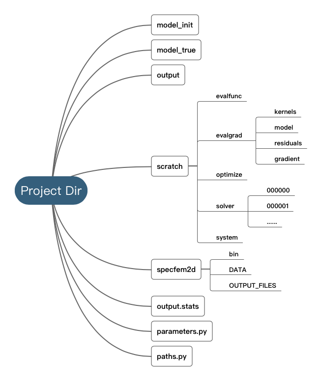

Project Dir Architecture
------------------------

A Seisflows project directory contains sovler, model and parameters, and they are well-organized in each folder. 
Figure below shows the typical architecture of project folders.

Variables in ``parameters.py`` and ``path.py`` define all parameters specified for any seisflow project. 
Once ``sfrun`` or ``sfsubmit`` is executed in the terminal, the first thing scripts will do is to read and parse these parameters with a ``ArgumentParser`` object.
Before submitting jobs to the local server, these two fiels require a careful check, avoiding or reducing unnecessary workload.

Parameter Files: ``parameters.py``
----------------------------------

``parameters.py`` contains a list of parameter names and values. Prior to a job being submitted, parameters are checked so that errors can be detected without loss of queue time or wall time. Parameters are stored in a dictionary that is accessible from anywhere in the Python code. By convention, all parameter names must be upper case. Parameter values can be floats, integers, strings or any other Python data type. Parameters can be listed in any order.

``General``

:``TITLE``:

    Project title.

:``WORKFLOW``:

    Workflow specified for seisflows. 'inversion' and 'migration' are currently supported.

:``SOLVER``:

    Time domain solver specified for seisflows. See :ref:`solver` and :ref:`sfsolver` for supported options.

:``SYSTEM``:

    System type supported for seisflows. See :ref:`system` and :ref:`sfsystem` for supported options..
    
:``OPTIMIZE``:

    Optimization method used for inversion. See :ref:`sfoptimize` for supported options.

:``PREPROCESS``:
    
    Preprocessing workflow specified. See :ref:`sfpreprocess` for supported options.
    
:``POSTPROCESS``:

    Postprocessing workflow specified. 'base' needs to be specified.

:``MISFIT``:

    Type of misfit for evaluation. See :ref:`sfmisfit` for supported options.

:``MATERIALS``:

    Materials of simulation domain. 'Elastic' and 'Acoustic' are currently supported. See seisflows.solver.base.

``Workflow``

:``BEGIN``:

    First iteration index.

:``END``:

    Last iteration index.

:``NREC``:

    Number of receivers.

:``NSRC``:

    Number of sources. SEM source file needs to be stored with a six-digit index suffix.

:``SAVEMODEL``:

    Frequency of saving model. ``1`` by default.

:``SAVEGRADIENT``:

    Frequency of saving gradient. ``1`` by default.

:``SAVEKERNELS``:

    Frequency of saving kernels. ``0`` by default.

:``SAVETRACES``:

    Frequency of saving traces. ``0`` by default.

:``SAVERESIDUALS``:

    Frequency of saving residuals. ``0`` by default.

``Preprocessing``

:``FORMAT``:

    Data file format.

:``CHANNELS``:

    Data channels. Currenly, 'su', or 'SU' need to be specified.

:``NORMALIZE``:

    Apply normalization for traces. 'NormalizeEventsL1', 'NormalizeEventsL2', 'NormalizeTracesL1', 'NormalizeTracesL2' are currently supported. See seisflows.preprocess.

``Filter``

:``BANDPASS``:

    Boolean type bandpass switch for traces.

:``FILTER``:

    Type of filter used. See :ref:`sfpreprocess` for supported options.

:``FREQMIN``:

    Low frequency corner.

:``FREQMAX``:

    High frequency corner.

``Mute``

:``MUTE``:

    List type switch for trace mute. :ref:`sfpreprocess` for supported options.

``Postprocessing``

:``SMOOTH``:

    Smoothing radius. See ``xsmooth_sem`` for usage.

``Optimization``

:``PRECOND``:

    Preconditioner type. See :ref:`path` and :ref:`sfprecond`.

:``STEPMAX``:

    Maximum trial steps

``Solver``

:``NT``:

    Number of time steps defined in Par_file.

:``DT``:

    Time step defined in Par_file.

:``F0``:

    Dominant frequency defined in SOURCE.

``System``

:``NTASK``:

    Number of tasks submitted. Currently, **NTASK** must satisfy 1 <= NTASK <= NSRC.

:``NPROC``:

    Number of processors.

:``MPIEXEC``: 

    MPI executable prefix, e.g., ``mpirun -np 13``. Note for a space at the end of the string, as seisflows concatenates the prefix with SPECFEM executable command.

.. _path:

Path Files: ``paths.py``
------------------------

``paths.py`` contains a list of path names and values. Prior to a job being submitted, paths are checked so that errors can be detected without loss of queue time or wall time. Paths are stored in a dictionary that is accessible from anywhere in the Python code. By convention, all names must be upper case, and all values must be absolute paths. Paths can be listed in any order.

:``DATA``:

    PATH contains seismic data if field data is used for inversion. Data of difference sources should be stored in separate folder. If ``DATA`` directory does not exist, seisflows would automatically generate synthetic data using model from ``MODEL_TRUE``.

:``MODEL_INIT``:
    
    PATH contains model file for initial iteraion.

:``MODEL_TRUE``:

    PATH contains true model for generating synthetic data.
     
:``PRECOND``:

    PATH to user supplied diagonal preconditioner. Seisflows will rescale model parameters based on user supplied weights. See :ref:`sfprecond`.

:``MASK``:

    PATH to mask file for gradient scaling. Mask needs to be stored mimicking the file format in which models are stored.    

:``SPECFEM_DATA``:

    PATH to SPECFEM ``DATA`` directory which contians Par_file, SOURCE, and other necessary inputs.

:``SPECFEM_BIN``:

     PATH to SPECFEM ``bin`` directory which contains binary executable command of SPECFEM solver.
